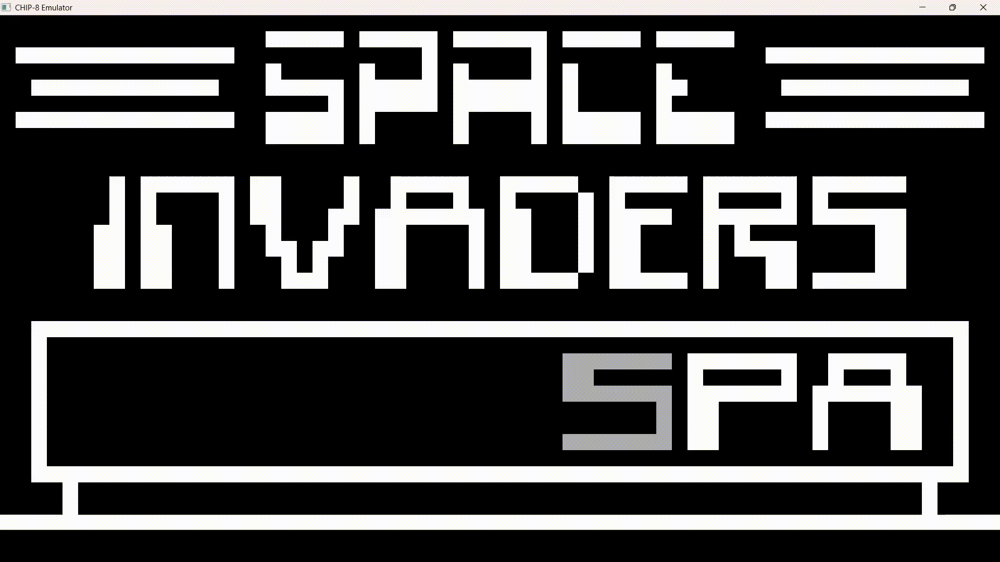

# CHIP-8 Emulator & Interpreter




This project is a cycle-accurate CHIP-8 interpreter built in C++17, focused heavily on computational efficiency and secure memory management. It seamlessly bridges retro 1970s hardware emulation with modern SDL3 hardware acceleration for both rendering and procedural audio.

To eliminate the overhead of traditional object-oriented design, the system utilizes a data-oriented, contiguous memory layout. This cache-friendly approach is paired with robust algorithmic bounds-checking to ensure zero-latency instruction dispatch and absolute memory safety—preventing buffer overruns even when executing malicious software.

## Key Features

* **Comprehensive Opcode Support:** All 35 standard CHIP-8 instructions are fully implemented, rigorously tested, and validated.
* **Constant-Time Dispatch:** Utilizes a highly optimized switch-case architecture for O(1) execution routing with zero overhead.
* **Zero-Cost State Serialization:** Instantaneous save (`F5`) and load (`F7`) functionality achieved through direct binary memory dumps, eliminating serialization latency.
* **Dynamic Procedural Audio:** Generates real-time square-wave PCM audio directly via SDL3 AudioStreams, removing the need for external sound files.
* **Integrated Debugging Capabilities:** Features a built-in execution pause (`SPACE`) and single-instruction stepping (`N`) to facilitate frame-by-frame behavioral analysis.
* **Real-Time Palette Switching:** Allows seamless cycling between Classic White, Amber CRT, and Hacker Green visual themes during runtime (`T`).
* **Configurable Execution Rate:** Permits users to adjust the CPU cycles processed per frame via command-line arguments to accommodate varying game speeds.
* **CRT Phosphor Simulation:** Employs a custom frame-buffer decay matrix to emulate vintage CRT ghosting, effectively mitigating the sprite flickering inherent to XOR-based rendering.
* **Decoupled Execution Timers:** CPU cycles operate independently (unthrottled or at a custom multiplier), while the Delay and Sound timers remain strictly bound to a synchronous 60 Hz hardware loop.
* **Algorithmic Memory Protection:** Enforces strict boundary checks to prevent stack overflow/underflow and out-of-bounds memory accesses.

## System Architecture
By utilizing a data-oriented architectural approach, the emulator maintains a flat, contiguous memory layout. Instead of fragmenting the virtual hardware into multiple abstract classes, the entire machine state is bundled into a unified Chip8 object, ensuring optimal CPU cache performance.

### Memory Layout
The virtual RAM is implemented as a flat 4KB `std::array<uint8_t, 4096>`. 
* **`0x000` to `0x1FF` (System Memory):** Reserved for interpreter operations. During boot, the standard 80-byte hex fontset is injected directly into the `0x050–0x09F` address block.

* **`0x200` to `0xFFF` (Program Space):** Dedicated entirely to loaded ROMs. To guarantee memory safety, the file loader validates that incoming ROMs are strictly under `3,584` bytes before any data is written, effectively eliminating the risk of buffer overflows.

### CPU & Registers
The processor contains 16 general-purpose 8-bit registers (`V0`–`VF`), a 16-bit index register (`I`), and a Program Counter (`PC`). The hardware stack is modeled as a fixed `std::array<uint16_t, 16>` managed by an 8-bit stack pointer (`sp`). The `VF` register operates exclusively as a flag register for ALU carries, borrows, and sprite collision detection.

### Display Engine

Graphics are rendered via a 64x32 linear frame-buffer (`std::array<uint32_t, 2048>`). 
Drawing instructions (`DXYN`) execute using byte-level bitwise XOR logic. Toggling an active pixel off dynamically sets the `VF` collision flag to 1. During the SDL3 render pass, inactive pixels undergo a mathematical brightness decay per frame rather than an instant clear, accurately simulating vintage CRT phosphor persistence.

### Input Management
Input state is maintained within a 16-key boolean array (`bool keypad[16]`), which is kept synchronized by the SDL3 event polling loop. The CPU evaluates keystrokes by directly reading this array for the `EX9E` and `EXA1` instructions, ensuring non-blocking execution. The sole exception is the `FX0A` opcode, which deliberately pauses the Program Counter to await user input.

## Execution Pipeline

To maintain cache efficiency, the emulator relies on a raw Fetch-Decode-Execute pipeline:

1. **Fetch:** The processor reads two sequential bytes from memory at the current `PC` and synthesizes a single 16-bit `opcode` via bitwise shifts. The `PC` immediately increments by 2.
2. **Decode & Execute:** The engine isolates the most significant nibble using a bitwise AND mask (`opcode & 0xF000u`), routing the instruction into the primary switch block.
3. **ALU Routing:** For densely packed opcode categories (e.g., `0x8000` arithmetic block or `0xF000` memory operations), a nested switch isolates the least significant nibble (`opcode & 0x000Fu`), resulting in instantaneous, hardware-accurate execution. 

## Memory Safety Implementation

Due to the intentional absence of type-safe OOP abstractions, memory safety is maintained algorithmically. The engine proactively defends against malicious or corrupted ROMs:

* **Stack Verification:** The `00EE` (Return) instruction is discarded if `sp == 0`. Similarly, `2NNN` (Call) is discarded if `sp >= 16`. This prevents stack pointer wrapping and unauthorized host memory access.
* **Index Bounds Checking:** During `DXYN` (Draw) and `FX55/FX65` (Register Load/Store) operations, the `I` register and drawing coordinates undergo explicit bounds validation. If `I + offset >= 4096`, the execution loop safely aborts to prevent segmentation faults.

## Building from Source

This project requires **SDL3** for hardware-accelerated video rendering, audio streaming, and input polling.

### Windows (MinGW Direct Compile)
```bash
g++ src/main.cpp src/chip8.cpp -o chip8_emu.exe -I include -I <path_to_SDL3_include> <path_to_SDL3_bin>/SDL3.dll
```


## Configuration & Constants

### Input Mapping
| CHIP-8 Hex Keypad | Modern Keyboard |
| :---: | :---: |
| `1` `2` `3` `C` | `1` `2` `3` `4` |
| `4` `5` `6` `D` | `Q` `W` `E` `R` |
| `7` `8` `9` `E` | `A` `S` `D` `F` |
| `A` `0` `B` `F` | `Z` `X` `C` `V` |

### Hardware Constants
| Constant | Value | Description |
| :--- | :--- | :--- |
| `RAM` | `4096` | Total virtual memory footprint (bytes) |
| `WIDTH` | `64` | Native internal screen width |
| `HEIGHT` | `32` | Native internal screen height |
| `ROM_OFFSET` | `0x200` | Standard entry point for software |
| `TIMER_HZ` | `60` | Fixed decrement rate for Delay/Sound |


### System Hotkeys
| Key | Action |
| :---: | :---: |
| `SPACE` | Toggle Execution Pause / Play |
| `N` | Step Next Instruction (Available while Paused) |
| `F5` | Save Current Machine State |
| `F7` | Load Saved Machine State |
| `F1` | Soft Reset (Reboots CPU & clears RAM) |
| `T` | Cycle Color Themes (White / Amber / Green) |

## Usage
Launch the compiled executable and pass the path to a ROM file via the command line. An optional second argument can be provided to manually configure the CPU cycles executed per frame:
```bash
# Execute with default speed (10 cycles per frame / ~600Hz)
./chip8_emu roms/space_invaders.ch8

# Execute with a custom hardware speed (e.g., 20 cycles per frame)
./chip8_emu roms/tetris.ch8 20
```